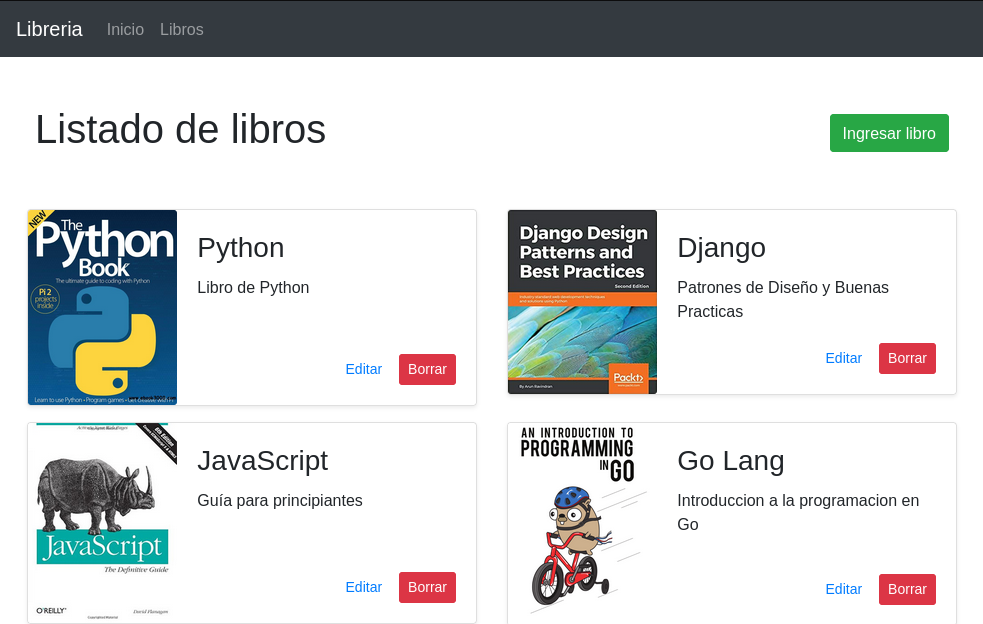

# Django CRUD Libreria
### CRUD para practicar django creando una libreria
Se pueden ingresar libros con nombre, descripción e imagen del mismo.

### Preview


## Requerimientos
* Python 3
* Pipenv `pip install pipenv`
* Docker y docker-compose (o en su defecto una base de datos MySQL)

## Setup

### Instalar las dependencias
```
pipenv install
```
### Configuración de la conexión a la base de datos
Crear archivo `.env` y copiar variables del archivo template `.env.example`, luego sustituir los datos de ejemplo por los de tu base de datos.

## Ejecución
1 - Correr la base de datos con docker
```
pipenv run db
```
2 - Correr las migraciones
```
pipenv run migrations
```
3 - Crear usuario admin
```
python3 manage.py createsuperuser
```
4 - Ejecutar el proyecto
```
pipenv run dev
```

### Listo ya tenes el proyecto corriendo en local :)